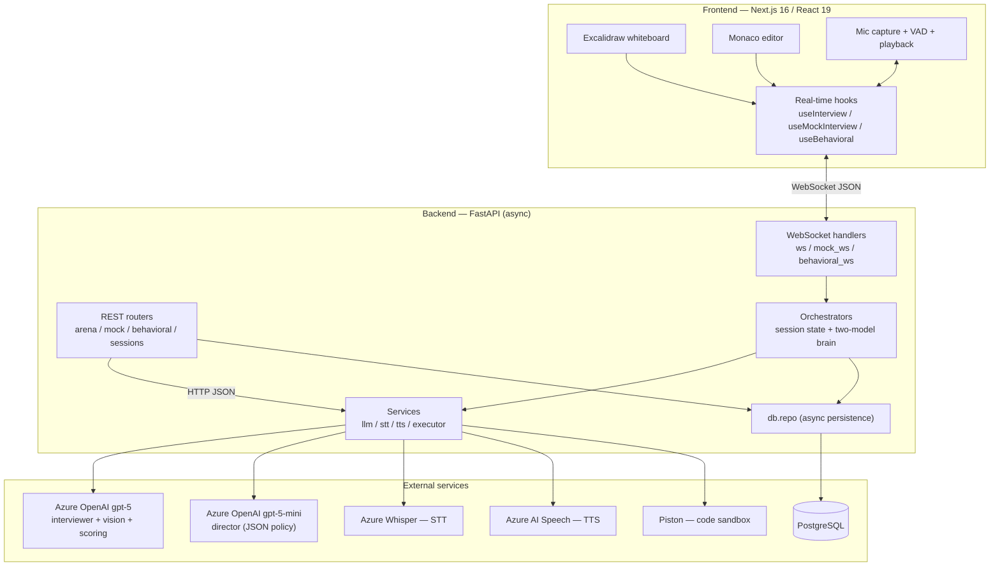

# Interviewwee

An AI interview-practice platform. A candidate picks a mode and an AI interviewer runs a
realistic session — it speaks, listens, reacts to what you say, watches what you draw or type,
and closes with a scored, rubric-based debrief. The name is a play on *interviewee*: the product
exists so you walk into the real thing already warmed up.

This repository is a solo, portfolio-grade build that is deliberately architected as a real
product rather than a demo. The interesting part is not any single feature — it is that the
system exercises the exact skills a senior AI engineer is hired for: real-time voice, agentic
orchestration, multimodal vision, structured evaluation, sandboxed execution, and resilient
persistence, wired together end-to-end.

> There is a full knowledge base in [`docs/`](docs/README.md) — architecture, data flow,
> per-module deep dives, and the design-decision rationale. This README is the entry point;
> the docs are the reference.

---

## The four pillars

Each mode is a self-contained interview surface with the AI interviewer at the center.

| Mode | What it is | The hard capability it exercises |
|------|------------|----------------------------------|
| **System Design Voice Room** | Two-way voice interview with a shared Excalidraw whiteboard the AI can *see*. Built deepest; this was the MVP. | Real-time voice + multimodal vision (reads your hand-drawn diagram) |
| **Coding Arena** | LeetCode-style drills, real execution against hidden tests, AI review + Big-O, progressive non-spoiler hints, spaced repetition. | Sandboxed execution of untrusted code |
| **Live Mock Coding** | Timed round in a **bare** editor (no autocomplete/linting). The AI watches you type and probes your reasoning. | Live turn-taking under a phase clock |
| **Behavioral Voice Round** | Spoken STAR-method Q&A that coaches you toward a complete, high-impact story. | Structured rubric scoring of open-ended answers |

All four are built and browser-verified.

---

## Architecture at a glance

Two transport styles, chosen to match the interaction: **HTTP/REST** for stateless
request/response (list problems, fetch a past session, run code) and **WebSocket** for the live
interview (bidirectional, streaming, stateful).



### The two-model interview brain

This is the core of the system and the piece worth being able to draw from memory. Every
conversational turn splits **policy** from **dialogue**:

- A cheap **director** (`gpt-5-mini`) decides *what to do* — the next stage and a move from a
  fixed vocabulary (`probe_deeper`, `challenge_tradeoff`, `inject_constraint`,
  `request_diagram`, `advance_stage`, …), returned as strict JSON. Invalid outputs are clamped
  to safe defaults in the orchestrator.
- An expensive **interviewer** (`gpt-5`) decides *how to say it* — it is the only place full
  prose is streamed, and the only place vision (the diagram) is attached.
- **Scoring** at session end is a third `gpt-5` call in strict-JSON mode over the transcript and
  final diagram.

That separation — a phase machine plus a per-turn move policy driven by a small director model —
is what makes the AI feel like an interviewer holding a bar, not a chatbot.

### Session state: in-memory, DB-backed

Live sessions live in an in-memory dict per orchestrator so the hot path stays fast. Persistence
to Postgres is **best-effort and asynchronous** — a DB error is logged and swallowed so it can
never break a live interview. If a session is missing from memory (e.g. the backend restarted),
`get_or_create` **rehydrates** it from the database — problem, stage, history, and diagram — so
the interview resumes. Speed of in-memory state, with a recovery path for the common failure.

---

## Tech stack

| Layer | Choice | Why |
|-------|--------|-----|
| Frontend | **Next.js 16 (App Router), React 19, TypeScript 5, Tailwind 4** | File-routed surfaces, typed message protocol over the socket |
| Editor / canvas | **Monaco**, **Excalidraw** | Credible coding surface; whiteboard that exports a PNG for vision |
| Backend | **FastAPI (async), Python 3.12+** | I/O-bound real-time workload; first-class WebSockets and typed config |
| Data | **PostgreSQL + SQLAlchemy 2.0 (async) + asyncpg** | Relational event log (sessions have ordered turns); `pgvector` path reserved for RAG |
| Interviewer / director | **Azure OpenAI `gpt-5` / `gpt-5-mini`** | Reasoning + vision + streaming; cheap reliable JSON for policy |
| Speech | **Azure Whisper (STT)**, **Azure AI Speech (TTS)** | Accurate transcription; natural low-latency neural voice |
| Sandbox | **Piston (self-hosted)** | Language-agnostic, isolated execution of untrusted code |
| Infra (local) | **Docker Compose** | Reproducible Postgres + Piston with one command |
| Quality (BE) | **Ruff**, **pytest + FastAPI TestClient** | One fast lint/format tool; offline tests with no LLM or live DB |

Guiding principle: use the boring, correct tool for each job and spend the complexity budget on
the one genuinely novel thing — the real-time agentic AI.

---

## Repository layout

```
interviewwee/
├── docker-compose.yml          # Postgres (pgvector) + Piston sandbox
├── .env.example                # single source of config for the backend
├── plan.md                     # living build plan / changelog
├── start.md                    # the two run commands
├── backend/                    # FastAPI app (see backend/README.md)
│   └── app/
│       ├── main.py             # app assembly, /health, /sessions
│       ├── config.py           # typed settings from the repo-root .env
│       ├── ws.py · mock_ws.py · behavioral_ws.py         # transport
│       ├── orchestrator.py · mock_orchestrator.py · …    # state + brain
│       ├── interviewer.py · mock_interviewer.py · …      # persona/policy prompts
│       ├── arena.py · arena_problems.py                  # Coding Arena (REST)
│       ├── services/           # llm · stt · tts · executor (thin adapters)
│       └── db/                 # models · repo · session
├── frontend/                   # Next.js app (see frontend/README.md)
│   └── src/
│       ├── app/                # routes: arena · mock · behavioral · design · history · replay
│       ├── components/         # Canvas · FeedbackReport · SiteHeader
│       └── lib/                # one real-time hook per pillar + API clients
└── docs/                       # full knowledge base (start at docs/README.md)
```

Each conversational pillar follows the **same four-file pattern** — `*_ws.py` (transport),
`*_orchestrator.py` (state + brain), `*_interviewer.py` (policy prompts), plus the shared
`services/`. The dependency direction is strict and one-way: transport → orchestration →
services/data. That is what makes each new pillar a near-clone of the first.

---

## Quickstart

### Prerequisites

- **Node.js 20+** and **Python 3.12+** (developed on 3.14)
- **Docker Desktop** (for Postgres + the Piston code sandbox)
- Azure credentials for the AI services you want to exercise (see [Configuration](#configuration)).
  The app boots without them; `GET /health` reports which integrations are configured, and
  unconfigured features degrade rather than crash.

### 1. Configure

```powershell
Copy-Item .env.example .env
# then fill in the Azure keys/endpoints and set a real POSTGRES_PASSWORD
```

Configuration lives in a **single `.env` at the repo root**; the backend reads it via
`app/config.py`. Keep `POSTGRES_PASSWORD` in the `.env` in sync with `DATABASE_URL`.

### 2. Start infrastructure (optional but recommended)

```powershell
docker compose up -d
```

Brings up **Postgres on `:5433`** (not 5432 — another container owns 5432 on the dev box) and
**Piston on `:2000`**. Persistence and the Coding Arena need these; the voice pillars run
without them (persistence just no-ops).

### 3. Backend — http://127.0.0.1:8000

```powershell
cd backend
python -m venv .venv
.\.venv\Scripts\Activate.ps1
pip install -r requirements.txt
uvicorn app.main:app --reload --port 8000
```

### 4. Frontend — http://localhost:3000

```powershell
cd frontend
npm install
npm run dev
```

The frontend targets the backend via `NEXT_PUBLIC_API_URL` (default `http://localhost:8000`) and
`NEXT_PUBLIC_WS_URL` (default `ws://localhost:8000`). The defaults work out of the box; override
them only if you move the backend.

---

## Configuration

All keys are read from the repo-root `.env`. Endpoints are optional — a missing key disables its
feature, it does not crash the app.

| Group | Keys | Purpose |
|-------|------|---------|
| Interviewer + vision | `AZURE_GPT5_ENDPOINT`, `AZURE_GPT5_API_KEY`, `AZURE_GPT5_DEPLOYMENT` | The interviewer voice, diagram vision, and scoring |
| Director | `AZURE_GPT5_MINI_ENDPOINT`, `AZURE_GPT5_MINI_API_KEY`, `AZURE_GPT5_MINI_DEPLOYMENT` | Cheap per-turn stage/move policy (JSON) |
| Speech-to-text | `WHISPER_ENDPOINT`, `WHISPER_KEY`, `WHISPER_DEPLOYMENT` | Transcription |
| Text-to-speech | `AZURE_SPEECH_KEY`, `AZURE_SPEECH_REGION`, `AZURE_SPEECH_VOICE` | Neural HD interviewer voice |
| Embeddings *(reserved)* | `AZURE_OPENAI_EMBED_*` | RAG prompt bank — wired but not yet used |
| Infrastructure | `DATABASE_URL`, `POSTGRES_*`, `PISTON_URL`, `FRONTEND_ORIGIN` | Postgres, the sandbox, and CORS |

Secrets are never returned by the API — `GET /health` exposes booleans only.

---

## API surface

| Method | Path | Purpose |
|--------|------|---------|
| `GET` | `/health` | Service status; which Azure integrations are configured |
| `GET` | `/sessions`, `/sessions/{id}` | Unified history across all modes; full session detail for replay |
| `GET` | `/arena/problems`, `/arena/problems/{id}` | Coding Arena problem bank |
| `POST` | `/arena/run`, `/arena/submit` | Execute against samples / grade against hidden tests |
| `POST` | `/arena/hint` · `GET` `/arena/progress` | Progressive hints; spaced-repetition progress |
| `GET` | `/mock/problems`, `/mock/sessions`, `/mock/sessions/{id}` | Live Mock problems and history |
| `GET` | `/behavioral/questions`, `/behavioral/sessions`, `/behavioral/sessions/{id}` | Behavioral bank and history |
| `WS` | `/ws/interview/{id}` · `/ws/mock/{id}` · `/ws/behavioral/{id}` | The live interview sockets (one per voice/live pillar) |

Interactive docs are served at `/docs` when the backend is running.

---

## Testing and linting

The backend suite runs **offline** — it hits real endpoints and orchestrator guards through
FastAPI's `TestClient` without needing an LLM or a live database.

```powershell
cd backend
pytest            # offline endpoint + orchestrator tests
ruff check .      # lint, import order, formatting (kept clean)
```

```powershell
cd frontend
npm run lint
```

---

## Scope: built vs. deferred

**Built and verified.** All four pillars end-to-end; the two-model interview brain with streamed
replies; voice out (TTS) and voice in (STT + client-side VAD + barge-in); diagram vision;
structured rubric scoring, feedback report, and full replay from the database; the Piston
sandbox with AI review, Big-O, hints, and spaced repetition; session persistence, unified
history, and rehydration after a backend restart; a **personalized prep plan** (JD + CV → a
curated, cross-pillar syllabus); cost/robustness hardening (per-client rate limiting, bounded
in-memory sessions, a stale-session sweep, refresh-safe session ids, a capped-retry reconnect);
an offline pytest suite (including a mocked WebSocket-loop test) and a ruff-clean backend.

**Deliberately deferred** (documented as roadmap, not missing work): auth / accounts /
multi-tenant / billing; RAG-backed, company-flavored question banks (the `pgvector` extension
and embeddings config are already wired for this, and would upgrade the prep plan to semantic
retrieval as the banks grow); an analytics dashboard; cloud deployment (the app runs locally
against Azure AI today, and the topology is already container-friendly).

Being explicit about scope is intentional: the system is architected to grow — pluggable
providers, a reserved embeddings/pgvector path — without over-building features nobody has asked
for yet.

---

## Operational notes

- **Postgres is on `:5433`**, not the default 5432.
- **Piston** caps `run_timeout` at 3000 ms and, in this dev setup, disables TLS verification for
  its runtime downloads (`NODE_TLS_REJECT_UNAUTHORIZED=0`) to get through corporate TLS
  inspection — **dev-only**, never production.
- **Whisper** is per-utterance (not streaming) and rate-limited; endpointing is handled by
  client-side VAD, and the STT interface stays pluggable to swap in a streaming provider later.
- A transient network blip auto-reconnects; a full backend restart rehydrates live context from
  the database.

---

## Further reading

Start with [`docs/README.md`](docs/README.md), then read in order:
[Overview](docs/01-overview.md) · [Features](docs/02-features.md) ·
[Architecture](docs/03-architecture.md) · [Tech Stack](docs/04-tech-stack.md) ·
[Data Flow](docs/05-data-flow.md) · [Backend](docs/06-backend-deep-dive.md) ·
[Frontend](docs/07-frontend-deep-dive.md) · [Data Model](docs/08-data-model.md) ·
[Design Decisions](docs/09-design-decisions.md) · [Interview Q&A](docs/10-interview-qa.md).

Component READMEs: [`backend/README.md`](backend/README.md) ·
[`frontend/README.md`](frontend/README.md). The living build plan is [`plan.md`](plan.md).
